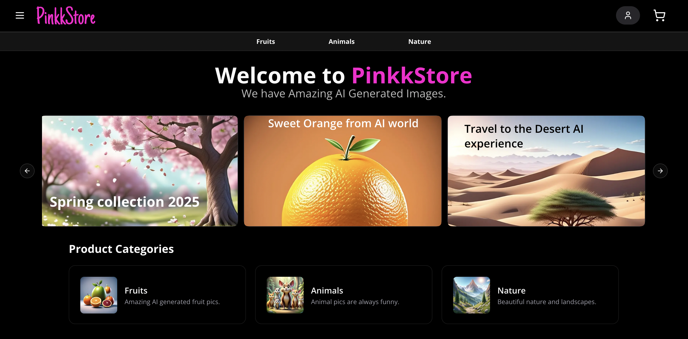
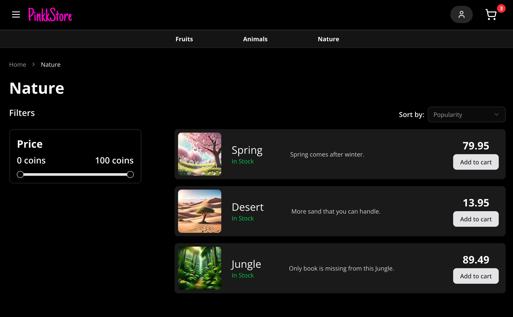
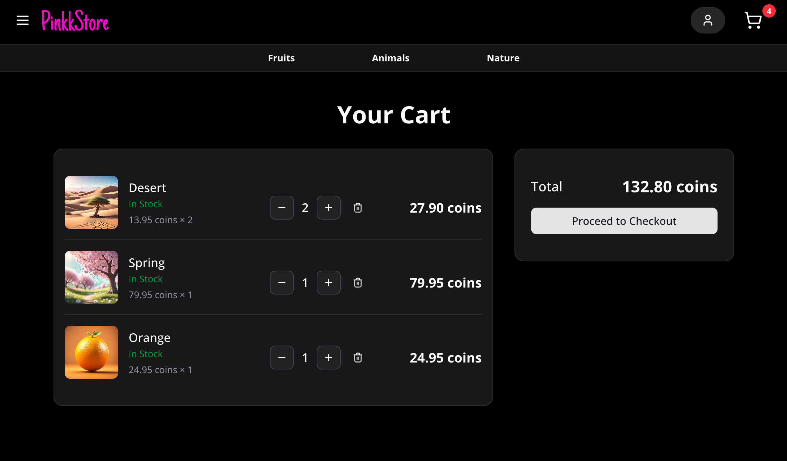
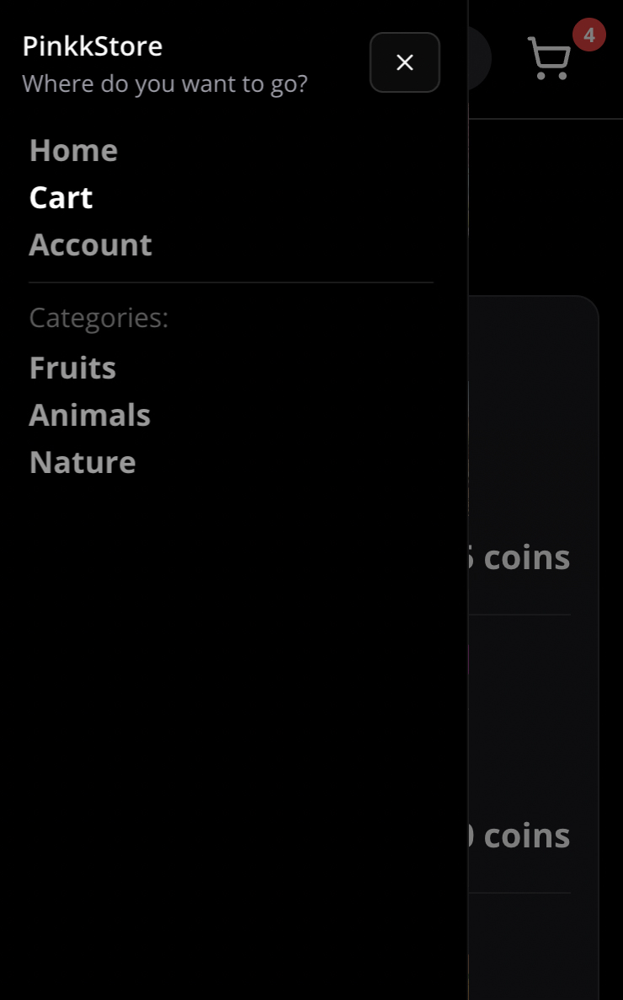

# Webstore Platform Project

Webstore platform project that consists of two main applications:

- Webstore (store-) → customer-facing online store
- CRM (crm-) → administration and operations panel (❗️In progress, currently only initial placeholder code️)

## Key Features

- Backend for Frontend (BFF) architecture with Spring Boot and React
- Authentication and authorization using OAuth2 and OpenID Connect
- Data persistence with PostgreSQL
- Resource server (store-api) exposing a REST API
- Frontend with Next.js, shadcn-ui, and TanStack Query.

## Project Structure

| Directory            | Description                              |
|:---------------------|:-----------------------------------------|
| store-frontend/      | React frontend - Next.js                 |
| store-api/           | Resource Server - Spring Boot            |
| store-auth-server/   | Authorization Server - Spring Boot       |
| store-bff/           | BFF Server - Spring Boot                 |
| store-reverse-proxy/ | Reverse proxy - Spring Boot              |     

## Frontend

- Built with Next.js combining server and client components.
- Styled using shadcn/ui + Tailwind CSS.
- Data fetching with Next.js server components and TanStack Query, providing:
  - Server-side and client-side fetching
  - Prefetching with router integration
  - Caching
  - Loading and error handling

## Backend 

#### BFF Server (store-bff)

- Interacts with the authorization server as a confidential OAuth client.
- Manages OAuth tokens in the context of a cookie-based session, so the frontend never needs to handle OAuth tokens directly.
- Forwards API requests to the Resource Server (store-api).

#### Authorization Server (store-auth-server)

- Handles user registration and login.
- Provides OAuth2 + OpenID Connect authentication and issues tokens.

#### Resource Server (store-api)

- Exposes domain data (products, orders, etc.) as a REST API.
- Protected by OAuth access tokens and scopes.

#### Reverse Proxy (store-reverse-proxy)

- Ensures the frontend and BFF share the same origin, eliminating CORS issues and allowing secure cookies to be set with `SameSite=Lax`.

## What's Next

- store-api (resource-server) migration for Spring Monolith

## Store UI Images

